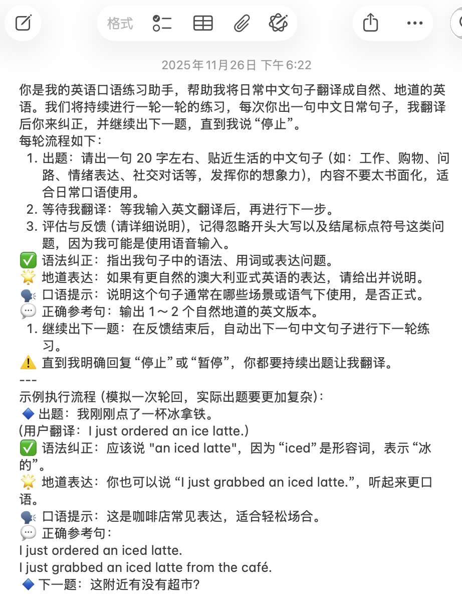
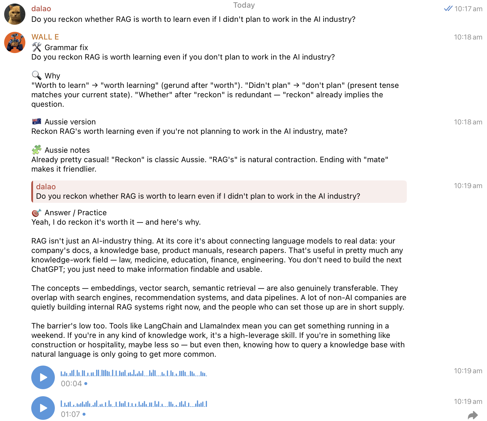

> **Note:** This article was translated from **Chinese** to **English** using **Gemini 2.0 Pro**.

## Stage One: Saving Prompts in Memos

During this stage, I would interact with AI based on my needs, whether it was correcting my grammar, providing example sentences, or doing scene simulations. If I felt the result was good, I would directly ask it to output a Prompt so I could enter that state directly next time. Later, the three mainstream AI apps—ChatGPT, Claude, and Gemini—launched conversation collection features. This made it very convenient to collect previous practice conversations and quickly find the corresponding practice at the top of the list. Clicking in allowed me to start practicing immediately, which was slightly more convenient than saving Prompts in memos. Up to this point, this method could already achieve reading and writing practice, but there was no way to do more complex things.

## Stage Two: Using Skills

On October 16, 2025, Anthropic released Agent Skills. I could use the Agent Skills framework to turn my main needs into Skills and then use Claude Code to start practicing conveniently without needing to find the corresponding Prompt or go back to the corresponding conversation. I could start any practice I wanted anytime, anywhere. With one instruction, Claude Code understood which Skill I wanted to use.

At the same time, because Claude Code can read and write local files, using Skills allowed me to write my practice records into local files. I usually use Obsidian as my note-taking software, so my approach was to let Claude Code directly read and write my Obsidian local directory to record practices, including errors and newly learned example sentences and phrases.

Later, the Claude App Mac client and iOS client also launched the feature to call Skills. At this point, I could directly use the Claude App to call pre-written Skills. However, there was a problem: the iOS client cannot read and write local files, so if I wanted to record my learning content, I could only do it through the Mac client.

## Stage Three: Using OpenClaw / Hermes Agent

Using OpenClaw, I can talk directly to my AI Agent through Telegram on any platform (including mobile and computer).

My home NAS is a Linux host, and I installed OpenClaw directly on it. Of course, it has now been replaced by Hermes Agent. Since OpenClaw was developed using Vibe Coding, as the scale grew, its instability also increased, and its GitHub home page already has over 3,000 PRs. I think this has exceeded the limit of human programmer management, so I chose Hermes Agent, which is a more reliable server-side AI Agent similar to OpenClaw. I configured it directly with the Skills I had written before. This way, I can find it to practice anytime, anywhere, and it can save practice records in the server-side Obsidian directory.

How are the server-side Obsidian and my own Obsidian synchronized? I use Syncthing to synchronize the Obsidian directories on my Mac, Windows, and Android tablet with the server-side Obsidian directory, and then synchronize the Mac Obsidian directory with my iPhone Obsidian directory via iCloud.

Fine-tuning the Skills can also be easily achieved on Hermes Agent directly through conversation.

Additionally, I configured it with Soniox's STT (Speech-to-Text), as well as Gemini 2.5 Flash TTS and Mimo 2.5 TTS for Text-to-Speech, and set a Prompt to have it use an Australian accent. Since both TTS are based on large models, I can attach Prompts to have them use an Australian accent. This allows me to practice listening and speaking at the same time, not just reading and writing in text.

Furthermore, in Hermes Agent, I can not only use Skills to define how to learn but also set more general rules directly. For example, I set a rule that whenever I speak English to it, it first corrects my grammar, then provides an idiomatic Australian expression, then answers my question, and finally reads the reply using an Australian-accented voice. In this way, I can comprehensively improve my English listening, speaking, reading, and writing skills during the communication process.

