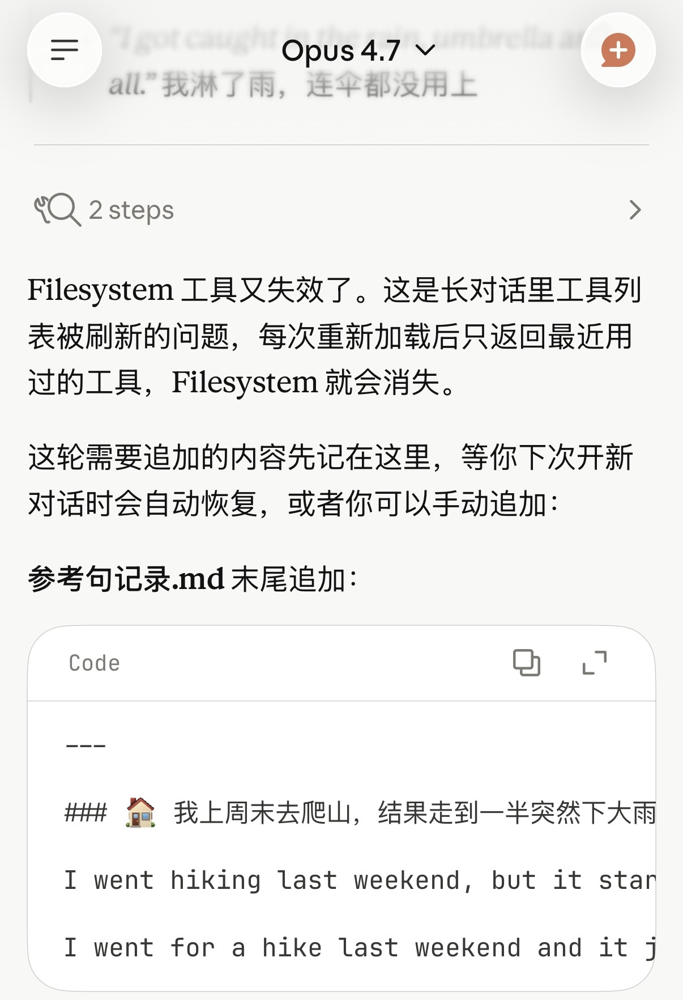

## 第一阶段：用备忘录保存Prompt

这个时候我会根据自己的需求和 AI 用对话的方式来实现我的需求，不管是纠正我的语法、提供例句，还是做场景模拟。如果我觉得效果不错，我会直接让它输出一个 Prompt，让它下次可以直接进入这个状态。后来 ChatGPT、Claude 和 Gemini 三大主流 AI App 都陆续上线了对话收藏功能。这让我们可以很方便地将之前的练习对话直接收藏，从而在置顶位置快速找到对应练习，点进去即可直接开始练习，这样会比用备忘录保存 Prompt 稍微方便一点，到目前为止，这种方式已经可以实现读和写的练习，但是还没有办法做一些更复杂的事情  。

## 第二阶段：用 Skills 

2025 年 10 月 16 日 Anthropic 发布了 Agent Skills，可以利用Agent Skills框架把自己的几个主要需求形成 Skills，再利用 Claude code 可以很方便地开始练习，不需要去找到对应的 Prompt，也不需要回到对应的对话。随时随地可以开始你想要的练习。通过一个指令，Claude Code 就明白你是想使用哪一个 Skill 。
同时因为 Claude Code 是可以读写本地文件的，所以利用 Skill 可以把自己的练习记录写在本地文件中。我平时使用Obsidian作为自己的笔记软件，所以我的用法是 让Claude code 直接读写 Obsidian 的本地目录，做好练习的记录，包括错误的记录以及新学到的例句词组的记录。
再后来，Anthropic 的 Claude App mac 客户端以及 IOS 客户端也上线了调用 Skill 的功能，这个时候可以直接使用 Claude App 调用提前写好的 Skills。但是有一个问题，它的 iOS 客户端不能读写本地文件，所以如果想记录自己的学习内容，只能通过 Mac 客户端。

## 第三阶段： 使用 OpenClaw / Hermes Agent

使用 OpenClaw 可以在任何平台（包括手机和电脑）通过 Telegram 直接和我的 AI Agent 对话 。
我的家庭 NAS 是一台 Linux 主机，我直接在上面安装了 OpenClaw。当然，现在已经更换成了 Hermes Agent。由于 OpenClaw 使用 Vibe Coding开发，随着规模越来越大，不稳定性也随之增加，它的 GitHub 主页上已经有 3,000 多个 PR 了。我认为这已经超出了人类程序员管理的极限，所以我选择了 Hermes Agent，它是一个实现了类似 OpenC law 且更可靠的服务端 AI Agent，我直接给它配置了我之前写好的 Skills。这样我可以随时随地找它练习，同时它可以把练习记录保存在服务器端的 Obsidian 目录。
服务器端的 Obsidian 是怎么和我自己用的 Obsidian 同步的呢？我用的是 Syncthing，让我的 Mac 端，Windows 端以及我的安卓平板端的 Obsidian 目录和服务器端的 Obsidian 目录同步，然后再通过 iCloud 让 Mac 端的 Obsidian 目录和我的 iPhone Obsidian 目录同步 。
然后对  Skills 的微调，在 Hermes Agent 上也可以非常方便地实现，直接通过对话的方式就可以实现 。
另外我为它配置了 Soniox 的 STT 语音转文字，以及 Gemini 2.5 Flash TTS 和 Mimo 2.5 TTS 的文字转语音技术，并且配置了让它说让它使用澳大利亚口音的 Prompt。因为这两个 TTS 都是基于大模型的 TTS，所以可以给它附加一些 Prompt，让它使用澳大利亚口音。这样可以让我同时练习听力和说话，而不只是练习文字上的读写 。
同时在 Hermes Agent 里，不仅可以使用 Skill 规定如何学习，还可以直接给它设定更通用的规则。例如，我设定了只要和它说英文，它就先纠正我的语法，再提供一个地道的澳大利亚式表达，然后再回答我的问题，最后还要用澳洲口音的语音朗读回复。这样我就可以在和它的沟通过程中，全面提升英文的听说读写能力。

